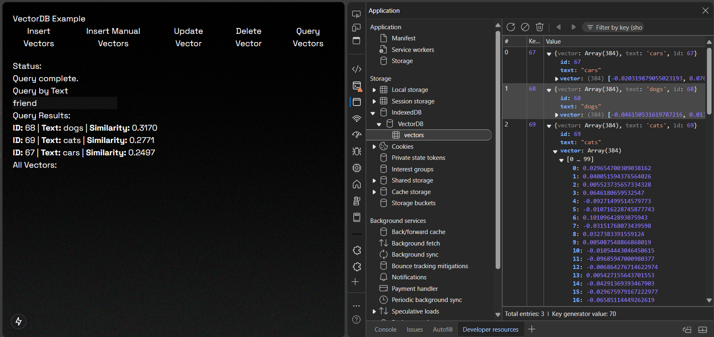
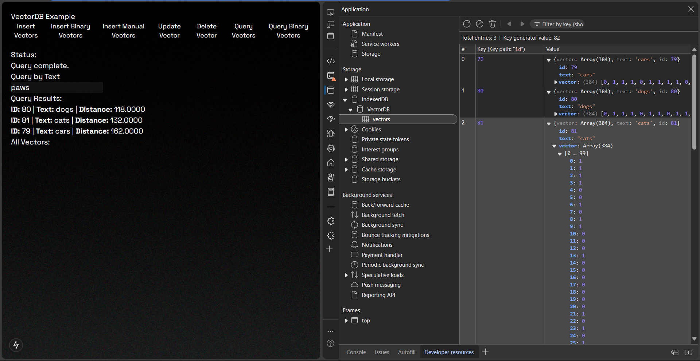
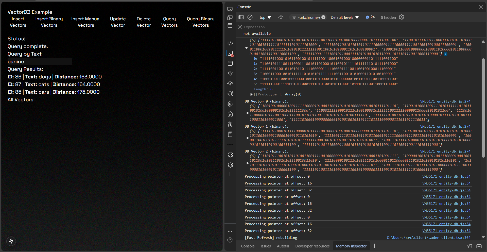

# EntityDB - Decentralized Ai Memory

### Storing Vector Embeddings In The Browser wrapping indexedDB and Transformers.js


## Overview

**EntityDB** is a powerful, lightweight in-browser database designed for storing and querying vectors. It integrates seamlessly with [IndexedDB](https://developer.mozilla.org/en-US/docs/Web/API/IndexedDB_API) for persistent storage and [Transformers.js](https://github.com/xenova/transformers) to generate embeddings from text, allowing you to build fast and efficient search systems with state-of-the-art models. Whether you're building search engines, recommendation systems, Ai memory or any app requiring vector similarity, EntityDB has got you covered.

## Features

- **In-browser**: Runs entirely in the browser using IndexedDB for local storage.
- **Seamless Integration with Transformers**: Easily generate text embeddings with Hugging Face models via Transformers.js.
- **Cosine Similarity Search**: Efficient querying based on cosine similarity between vectors.
- **Flexible**: Supports both automatic embedding generation and manual insertion of pre-computed embeddings.
- **Lightweight**: No need for a server-side component or complex setup.



## Installation

To install **EntityDB** in your project, run:

```bash
npm install @babycommando/entity-db
```

```bash
yarn add @babycommando/entity-db
```

```bash
pnpm add @babycommando/entity-db
```

```bash
bun add @babycommando/entity-db
```

## Usage

### Importing the Library

```js
import { EntityDB } from "@babycommando/entity-db";

// Initialize the VectorDB instance
const db = new EntityDB({
  vectorPath: "db_name",
  model: "Xenova/all-MiniLM-L6-v2", // a HuggingFace embeddings model
});
```

### Inserting Data with Automatic Embedding Generation

You can insert data by simply passing a text field. The library will automatically generate embeddings using the specified transformer model.

```js
await db.insert({
  text: "This is a sample text to embed",
});
```

### Inserting Manual Vectors

If you already have precomputed vectors, you can insert them directly into the database.

```js
await db.insertManualVectors({
  text: "Another sample",
  embedding: [0.1, 0.2, 0.3, ...] // your precomputed embedding
});
```

### Querying (Cosine Similarity)

You can query the database by providing a text, and EntityDB will return the most similar results based on cosine similarity.

```js
const results = await db.query("Find similar texts based on this query");
console.log(results);
```

### Querying Manual Vectors

If you have precomputed vectors and want to query them directly, use the queryManualVectors method.

```js
  const queryVector = [0.1, 0.2, 0.3, ...]; // your precomputed query vector
  const results = await db.queryManualVectors(queryVector);
  console.log(results);
```

### Updating a Vector in the Database

If you need to update an existing vector in the database:

```js
await db.update("1234", {
  vector: [0.4, 0.5, 0.6], // Updated vector data
  metadata: { name: "Updated Item" }, // Additional updated data
});
```

### Deleting Data

You can delete a vector by its key.

```js
await db.delete(1);
```

---

## Experimental: Binary Vectors

While querying vectors by cosine similarity is already extremely fast, sometimes you want to go faster than light. Binary vectors are simplified versions of dense vectors where each value is turned into either a 0 or a 1 by comparing it to the middle value (median). This makes them smaller to store and faster to compare, which helps when working with a lot of data.

Note that this simplification can reduce the quality of the results because some detailed information in the original dense vector is lost. Use it for very long searches. For example, the set of vectors produced by _all-MiniLM-L6-v2_:

`[ -0.020319879055023193,  0.07605013996362686, 0.020568927749991417, ...]`
after being binarized becomes:
`[ 0, 1, 1, ...]`

For better JS processing, the binary vectors are packed into 64-bit integers (e.g., using BigUint64Array).
Each 64-bit integer represents 64 binary values, and we use the XOR operation on 64-bit integers to find mismatched bits and then count the 1s.

### Inserting Data and Generate Binarized Embeddings

To insert data to be vectorized and then binarized, use _insertBinary_.
Note: to query over binarized vectors, use _queryBinary_ or _queryBinarySIMD_.

```js
await db.insertBinary({
  text: "This is a sample text to embed and binarize",
});
```

### (Very Fast) Query Binarized Embeddings Using Hamming Distance Over Native JS (64 bits at a time max)

To query over binarized vectors use _queryBinary_.
While cosine similarity measures the angle between two vectors in a multi-dimensional space, Hamming distance counts the number of positions where two binary vectors differ. It measures dissimilarity as a simple count of mismatches. For binarized vectors Hamming really is the tool for the job.

```js
const results = await db.queryBinary("Find similar texts based on this query");
console.log(results);
```

Example of a binary hamming distance query over BigUint64Array (64 bits processed at a time using pure JS):


### (Insanely Fast) Query Binarized Embeddings Using Hamming Distance Over WebAssembly SIMD (+128 bits at a time, shorter CPU cicles)

The WebAssembly SIMD implementation processes 128 bits per iteration (via v128.xor) compared to 64 bits per iteration in the JavaScript implementation using BigUint64Array. This alone gives a theoretical 2x speedup.

However SIMD instructions execute XOR, popcount, and similar operations on multiple data lanes in parallel. This reduces the number of CPU cycles required for the same amount of work compared to sequential bitwise operations in JavaScript. SIMD in WebAssembly is likely 2x to 4x faster or more over big vectors.

Check haming_distance_simd.wat for the WASM source code. Compiled using wat2wasm.

```js
const results = await db.queryBinarySIMD(
  "Find similar texts based on this query"
);
console.log(results);
```

Example of a binary hamming distance query over WebAssembly SIMD (+128 bits at a time, shorter CPU cicles):

The logs show offsets (0, 16, 32), which means the code processes 128 bits (16 bytes) at a time. Since the total vector is 384 bits, it takes 3 steps (384 ÷ 128 = 3), confirming 128-bit SIMD processing.

---

#### For Nextjs

If you're using Next.js, you may need to configure Webpack to work with Transformers.js. Add the following to your next.config.js file:

```js
  webpack: (config) => {
    // Override the default webpack configuration
    config.resolve.alias = {
      ...config.resolve.alias,
      "onnxruntime-node$": false, // Disable onnxruntime-node for browser environments
      "sharp$": false, // optional - Disable sharp package (used by some image processing packages)
    };

    return config;
  },
```

## Contributing

Feel free to fork the repository, create issues, and submit pull requests. We welcome contributions and suggestions!

## License

This project is licensed under the Apache License 2.0.
